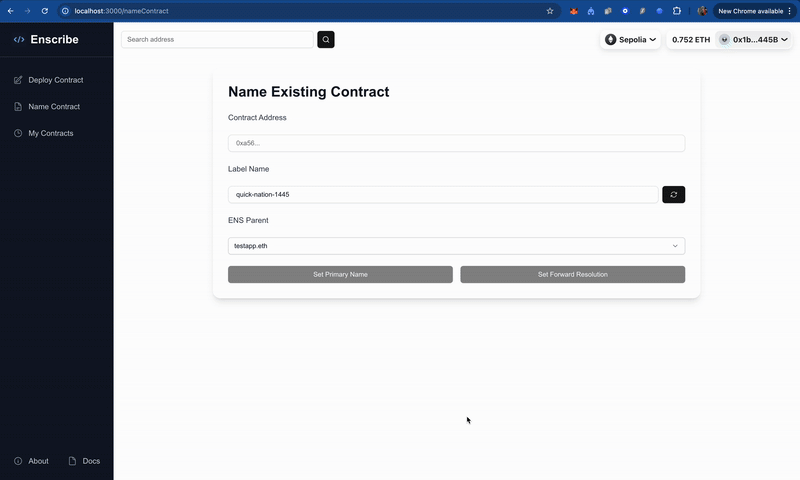
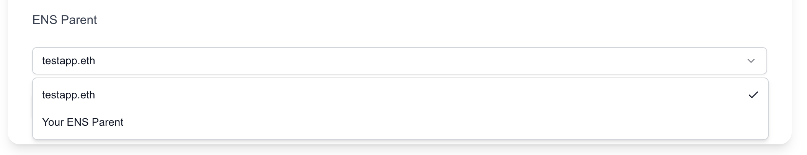
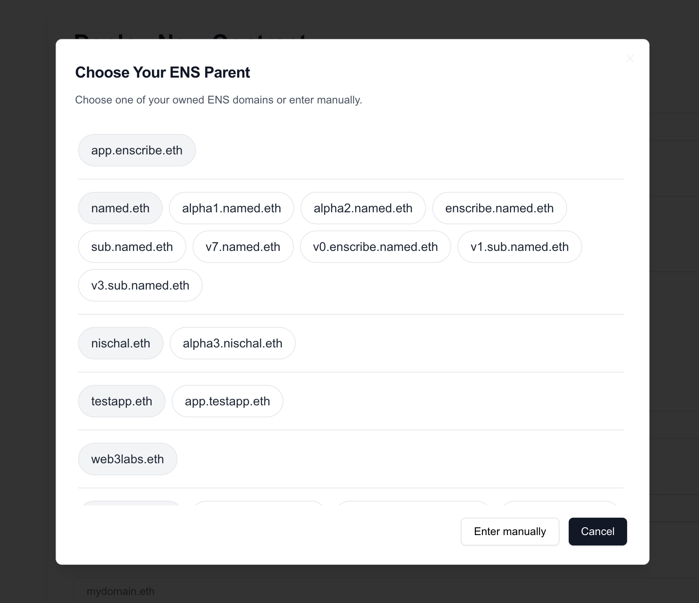
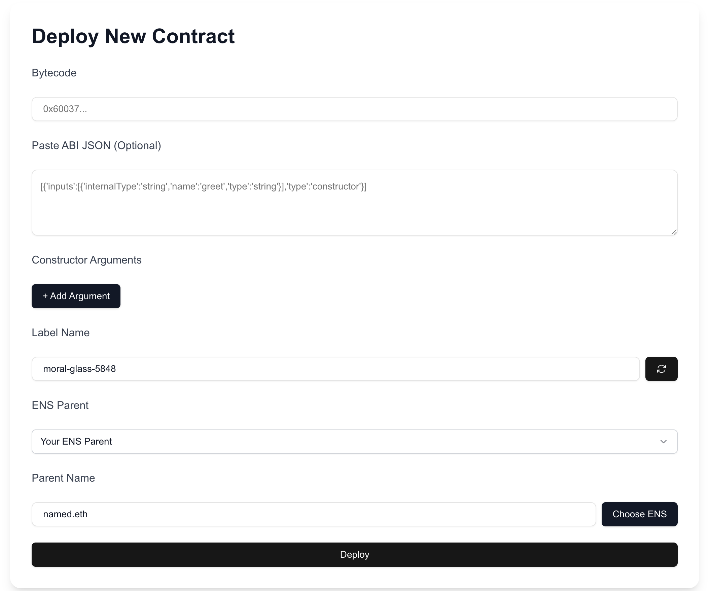

We’ve rolled out a highly useful feature in Enscribe — the ability to easily choose your **owned or managed ENS domains** when deploying or naming smart contracts. This makes the ENS parent selection process smoother, safer, and more intuitive.

Thanks to the integration with **ENS subgraph**, Enscribe can now fetch all ENS names that your connected wallet **owns or manages**, and present them to you in a simple, organized UI.

## How It Works
When a user connects their wallet, Enscribe queries the ENS subgraph and retrieves a complete list of ENS domains owned or managed by that wallet. These names are then:

- Grouped by second-level domain (2LD)  
- Sorted alphabetically  
- Displayed in a scrollable, intuitive modal

## Demo

Check out this quick demo video of the feature in action:  

Here’s how it looks in Enscribe:

**Dropdown view inside Deploy form:**  

**Choosing ENS Parent (modal):**  

**Deploy Contract Form with ENS selection:**  

## Why It Matters

Before this update, users had to **remember and manually type** their ENS parent name — introducing room for typos and uncertainty. Now, with direct selection from your owned and managed names, you:

- Eliminate input errors  
- Save time and cognitive effort  
- Improve the overall UX of naming contracts with ENS

This feature is currently supported on:

- **Ethereum Mainnet & Sepolia** — via the official ENS subgraph  
- **Linea Mainnet & Linea Sepolia** — via ENS Linea subgraph  
- **Base Mainnet** — via ENS Node by [namehash](https://github.com/namehash/ensnode)

**Note**: Support for **Base Sepolia testnet** is pending because no ENS subgraph exists yet. We're actively working with Namehash to add support — see [GitHub issue #768](https://github.com/namehash/ensnode/issues/768).

## Try It Out

Visit [enscribe.xyz](https://www.enscribe.xyz) and try the new ENS parent selection workflow in both the **Deploy** and **Name Contract** flows. 
Let us know what you think — your feedback helps us shape a smoother, safer, and more trusted smart contract experience.

We'd love to hear your feedback on this feature — join our [Discord community](https://discord.gg/8QUMMdS5GY) or [Telegram](https://t.me/enscribers) communities and let’s eliminate hex smart contract addresses for users.

Happy naming! 🚀