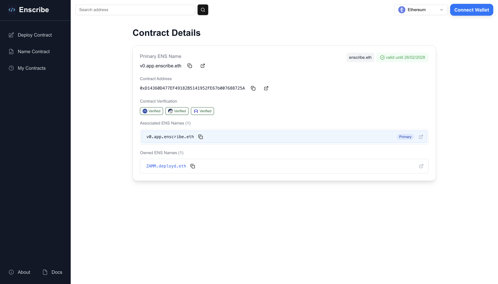
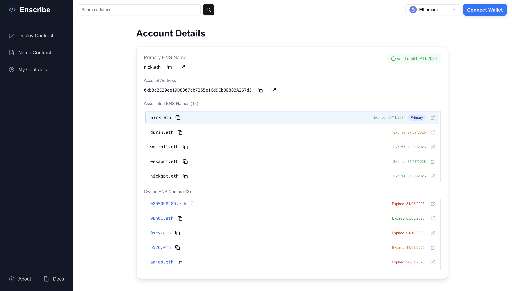

# Introducing Enscribe's Powerful New Features

We're thrilled to announce a significant update to [Enscribe](https://app.enscribe.xyz) that makes exploring addresses - EOAs and smart contracts easier than ever before. Our latest release focuses on shareable links, cross-chain support, and seamless ENS integration.
We want to make Enscribe as the main tool for contract naming and exploration.

## What's New? A Quick Overview

This release brings a lot of new features that make Enscribe more accessible and useful.

- **Universal Search** - Search for any address (EOA or contract) or ENS name without connecting your wallet
- **Multi-Chain Exploration** - View account and contract details across Ethereum, Linea, and Base networks
- **Smart Contract Details** - Automatic contract detection with verification status across Etherscan, Sourcify, and Blockscout
- **Enhanced ENS Integration** - View associated and owned ENS names with detailed expiry information
- **Shareable Links** - Direct links to any address or contract for easy sharing

## Search Without Limits

Our new universal search bar allows you to search for any address (EOA or contract) or ENS name without connecting your wallet. Simply paste an address or type an ENS name, and Enscribe goes to work fetching ENS details and verification status if it is a contract.


The search supports:
- Ethereum addresses (0x...)
- ENS names
- Automatic chain detection and switching

Perhaps most impressive is the intelligent ENS resolution system, which automatically uses the appropriate chain provider (mainnet or Sepolia) to resolve names and redirect you to the correct address page for that chain.

## The New Explore Page

The heart of our update is the new Explore page that brings interesting ENS details about any Ethereum address to a single place. What makes this page special is its detection system that automatically determines whether you're viewing a regular account (EOA) or a smart contract, then tailors the display accordingly with the most relevant information for each type.

Accessing any address is simple through our user-friendly URL format:

```
https://app.enscribe.eth/explore/<chainId>/<address>
```

This standardized URL structure makes addresses easy to bookmark and share with others, allowing for collaborative exploration of the Ethereum ecosystem.

### Contract Details View

When viewing a contract, the display includes:

- Primary ENS name (if registered) with appropriate icon for expiry status (green tick for valid, yellow exclamation for expiring, red X for expired)
- Comprehensive contract verification status (Sourcify, Etherscan, Blockscout)
- Direct links to verified contracts on respective platforms
- If not verfied, user can select "Verify" button to verify the contract on respective platform
- All associated ENS names
- ENS names owned or managed by the contract with color-coded expiry dates
- One-click copy functionality for addresses and ENS names with visual feedback



This rich interface makes it easy to understand the contract's on-chain identity and verification status at a glance, while providing direct access to relevant external resources for further investigation.

### Account Details View

For regular Ethereum accounts (EOAs), the page adapts to highlight information most relevant to individual addresses:

- Primary ENS name and avatar (if available) with appropriate icon for expiry status (green tick for valid, yellow exclamation for expiring, red X for expired)
- All associated ENS names
- ENS names owned or managed by the address with expiry information
- Quick copy features for addresses and ENS names



For both Accpount and Contract you have external links - for address directs to Etherscan and all ENS names direct to ENS app.
Owned or managed ENS names have hyperlink text to Enscribe Explore page. It resolves the ENS name to address and opens it in Enscribe.

The ENS resolution system:
- Opens resolved addresses in a new tab for convenient exploration
- Shows toast notifications for failed resolutions

## Smart Chain Selector

The new chain selector makes navigating the multi-chain world effortless and intuitive. Located prominently in the interface, this component provides a consistent way to switch between networks while maintaining context about the address you're exploring.

The chain selector intelligently adapts to your wallet connection state:

**When Wallet is Not Connected:**


- Select any supported chain to view data for that specific network
- Manually switch between chains to compare data across networks
- All address and ENS data is fetched for the selected chain

**When Wallet is Connected:**


- Chain selector automatically syncs with your connected wallet's network
- When switching chains on wallet, you'll be redirected to view the same address on the newly selected chain

## Multi-Chain Support

Enscribe supports multiple chains:

- **Ethereum Mainnet** 
- **Ethereum Sepolia** 
- **Linea Mainnet** (.linea.eth)
- **Linea Sepolia** (.linea-sepolia.eth)
- **Base Mainnet** (.base.eth)
- **Base Sepolia** - Partial support (in progress - working with ENS node Namehash team for full integration)

What makes this multi-chain support special is how the platform handles chain-specific ENS resolution and verification status checks. As you switch between chains, the URL is dynamically updated to reflect the new chain ID, creating shareable, chain-specific links to any address — perfect for users to share with others.

## Looking Forward

This major update represents a significant milestone for Enscribe, making it more useful specially for smart contracts.

Stay tuned for more exciting features in our roadmap:

- Additional L2 network support
- Ethereum Follow Protocol support
- More ENS management features and details

These upcoming features will build upon the foundation we've established with this release.

## Try It Now!

We're incredibly excited to share these new capabilities with our community. Experience all these features today by visiting [Enscribe App](https://app.enscribe.xyz).

Your feedback shapes our development roadmap, so we'd love to hear your thoughts on these new features. Join our [Discord community](https://discord.gg/8QUMMdS5GY) or [Telegram](https://t.me/enscribers) to share your experiences or follow us on [Twitter/X](https://x.com/enscribe_) for the latest updates and announcements.

Happy naming! 🚀
