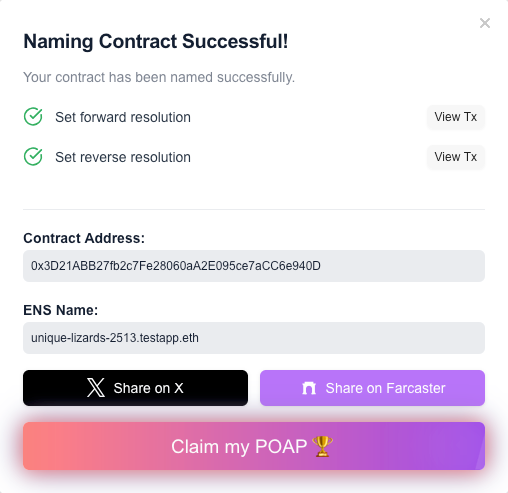
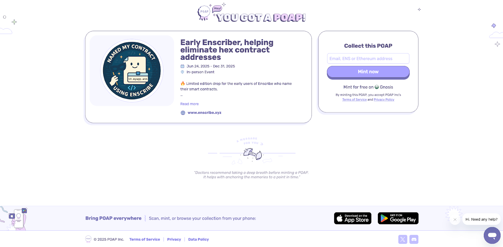

We believe naming a smart contract is vital for improving the UX and security for users of Ethereum apps.

At Enscribe, to reward our early users, we’ve created our first [POAP](https://poap.zendesk.com/hc/en-us/articles/9494654007437-What-is-POAP) drop! Now, every time you successfully name a smart contract using Enscribe, you can mint an exclusive, limited-edition POAP to show you’re one of the early namers of smart contracts.

You can also easily announce your contract name on X and Farcaster via our brand new sharing buttons.

POAPs are unique, verifiable badges that live onchain, just like the contracts you’re naming. Now, each naming via Enscribe can be marked with a minted POAP, serving as both a personal achievement and a public badge of your contributions to the Ethereum ecosystem.

But hurry, this POAP drop is limited and won’t be available forever.

To access the POAP, head to the [contract naming](https://app.enscribe.xyz/nameContract) page in the Enscribe App.

Once you complete the naming process for a contract on Enscribe, you’ll see the completion dialogue showing details such as the transactions performed, contract address, ENS name and our new buttons!

Simply click the *Claim my POAP* to mint your POAP. This will take you  to the POAP App where you can mint the POAP by putting your email address or Ethereum address for free.

If you fancy sharing that you named your contract using Enscribe App on X or Farcaster, that would be massively appreciated too. We need our users to spread our message throughout the Ethereum ecosystem.

Here’s a video tutorial demonstrating how you can claim your POAP:

https://youtu.be/oE_Kcl0REwU

In the meantime, head to the [Enscribe App](https://app.enscribe.xyz) to name your contract and claim your POAP to show you were there in the beginning!