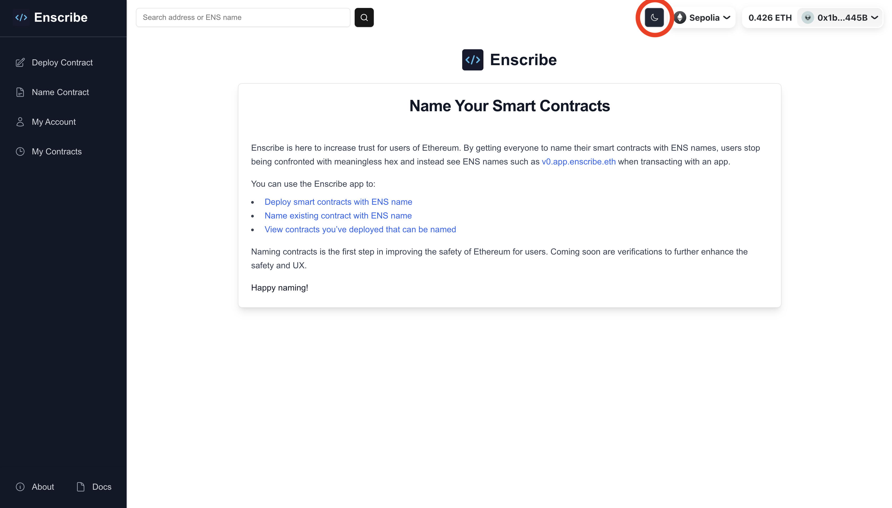
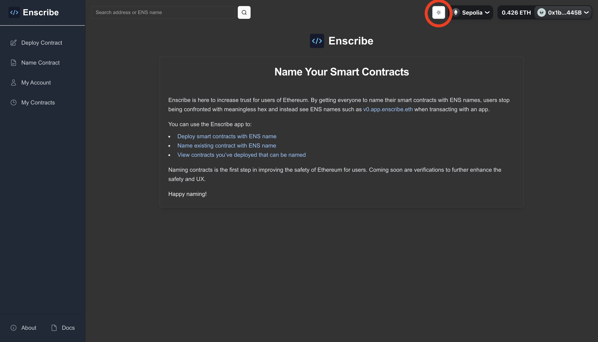
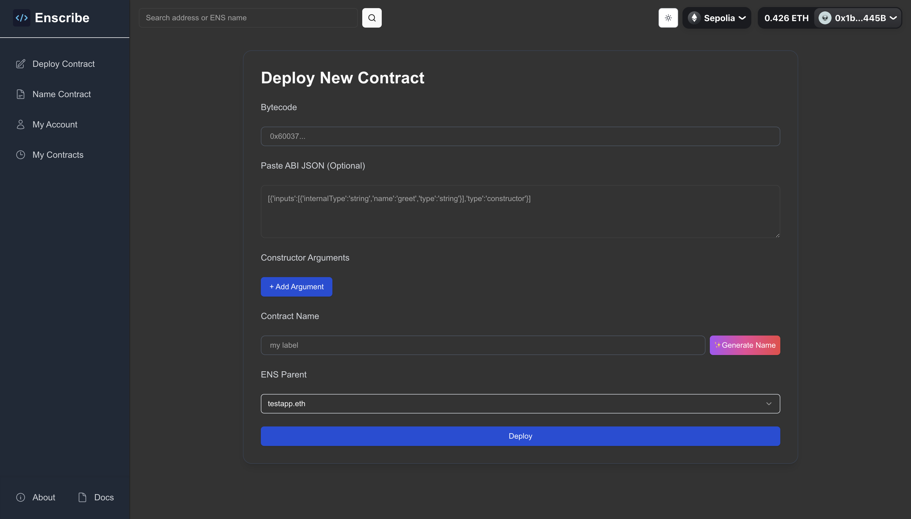
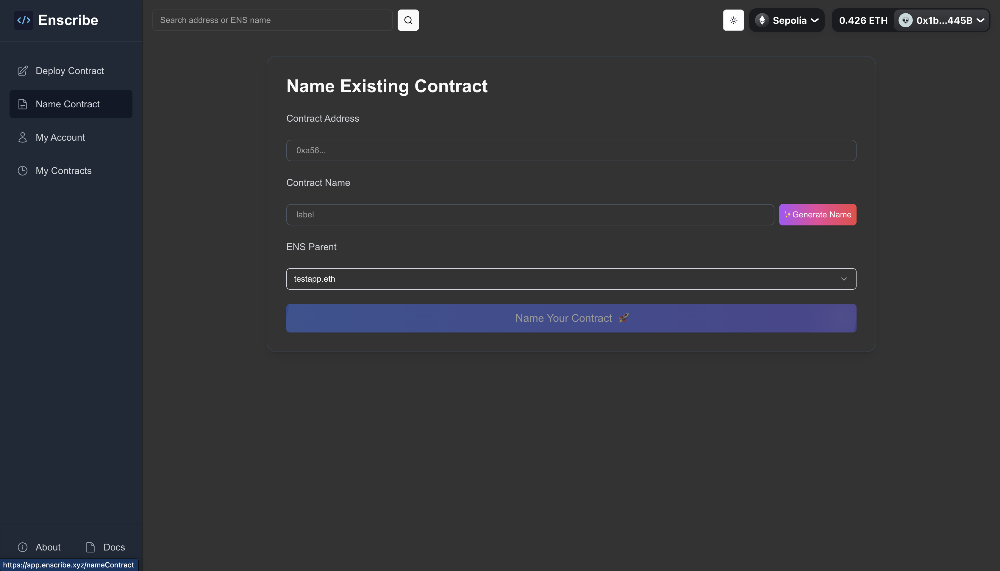
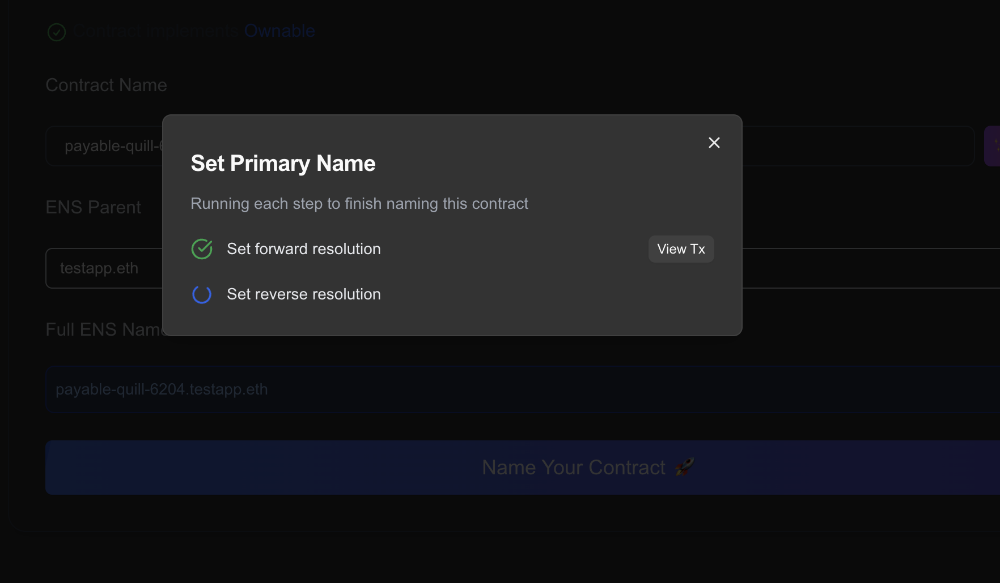
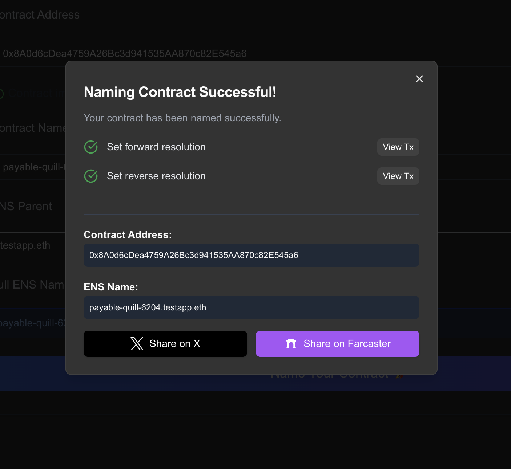
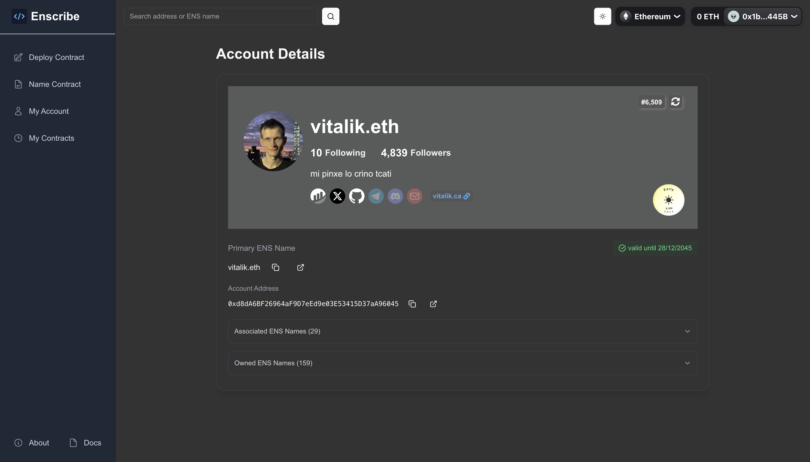
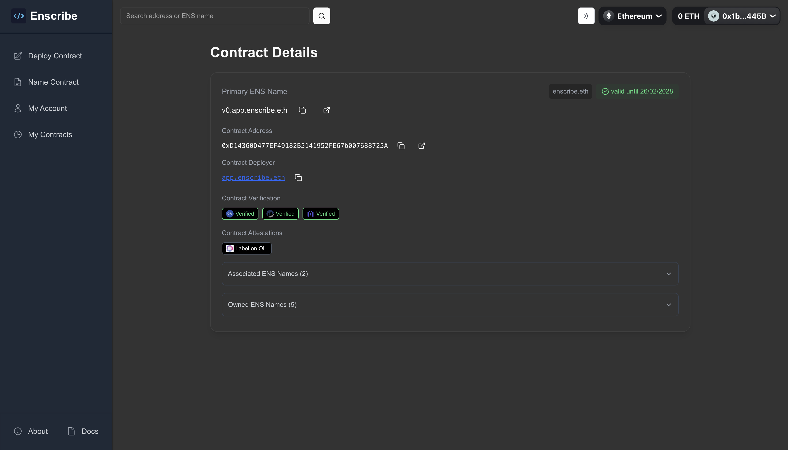
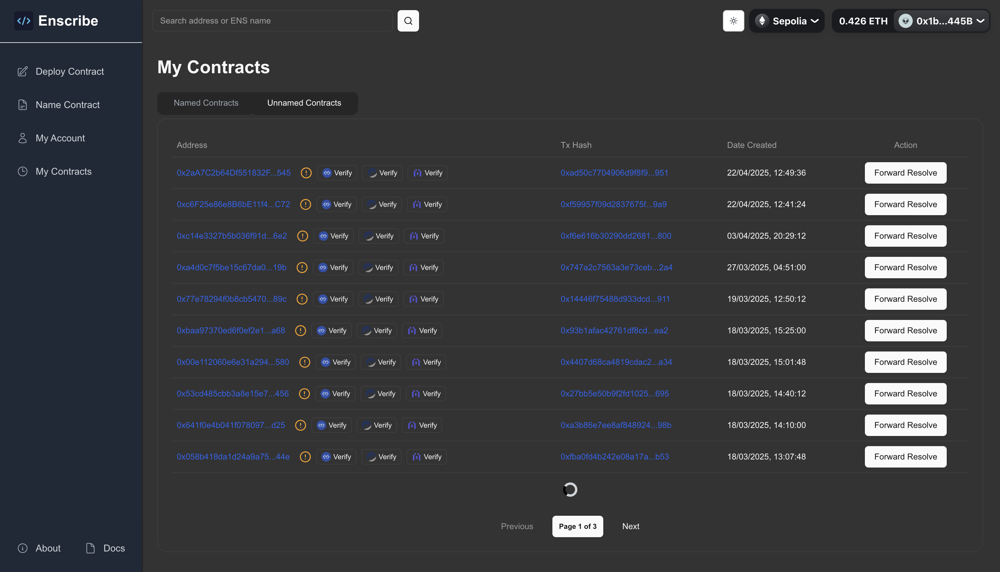

import AppUrl from '@site/src/components/AppUrl';

At [Enscribe](https://app.enscribe.xyz), we're dedicated to improving the onchain experience by making smart contract addresses more human-readable and user-friendly through ENS naming. While making the ENS naming experience more user-friendly, we also want to improve the UI/UX of the Enscribe platform. In line with this commitment, we're excited to announce a key UI/UX enhancement: **Enscribe now fully supports a dark mode theme!**

|  |  |
|:---:|:---:|

You can find the theme toggle button in the top right corner of the Enscribe application. The white sun icon indicates the light theme, and the dark moon icon activates the new dark theme.

Every screen within Enscribe now seamlessly adapts to dark mode, designed with carefully chosen color contrasts for optimal readability. This ensures a consistent and comfortable visual experience across the entire application, whether you're deploying a new contract or reviewing your existing ones.

We've ensured that key workflows, from **deploying new contracts** and **naming existing ones** to viewing your **account details** and **managing your contracts**, are all optimized for the new dark theme. The improved contrast aims to make your interactions with Enscribe smoother and less straining on the eyes.

### What's Next

This update is part of our ongoing commitment to improve the Enscribe's user experience.

We build based on community feedback. Share your thoughts and suggestions in our [Discord community](https://discord.gg/8QUMMdS5GY) or [Telegram](https://t.me/enscribers), or follow updates on [Twitter/X](https://x.com/enscribe_).

Try out the new dark mode today at <AppUrl/>!

Happy naming! 🚀