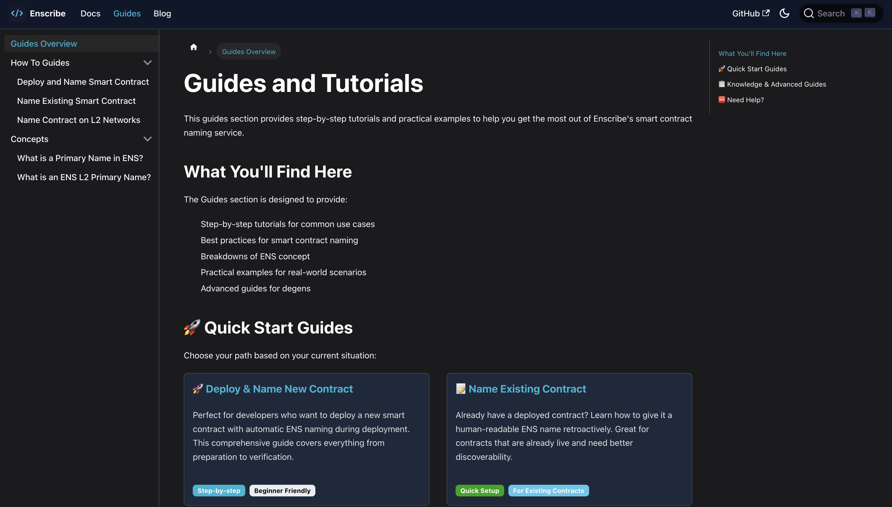

We launched a new Guides section to help developers deploy and name smart contracts with Enscribe. Think of it as a hands-on companion to our technical documentation.

## What's New

The Guides section focuses on practical tutorials you can follow along. While our documentation covers technical details, these guides walk you through real workflows step by step.

*The new Guides section*

## What You'll Find

### Quick Start Guides

We organized the most common use cases:

- [**Deploy & Name New Contract**](/guides/how-to-guides/deploy-and-name-smart-contract) — Deploy fresh smart contracts with ENS naming during deployment
- [**Name Existing Contract**](/guides/how-to-guides/name-existing-smart-contract) — Add ENS names to contracts that are already deployed  
- [**L2 Contract Naming**](/guides/how-to-guides/name-contract-l2-networks) — Name contracts on Layer 2 networks

### Conceptual Guides

For developers who want to understand the underlying concepts:

- [**ENS Primary Names Explained**](/guides/concepts/ens-primary-names-explained) — Forward vs. reverse resolution
- [**L2 Primary Names Explained**](/guides/concepts/l2-primary-names-explained) — Cross-chain ENS identity

## Getting Started

Head to the [Guides section](/guides) and pick your path. Whether you're deploying your first contract or managing multiple contracts across chains, we have guides that fit your workflow.

We will be expanding the guides and add more real world examples and use cases.

## Share Your Feedback

What guides would help your development workflow? Join our [Discord](https://discord.gg/8QUMMdS5GY), [Telegram](https://t.me/enscribers), or [X](https://x.com/enscribe_) to share ideas and connect with other developers using Enscribe.

Visit the [Guides section](/guides) to start naming your smart contracts.

Happy naming! 🚀