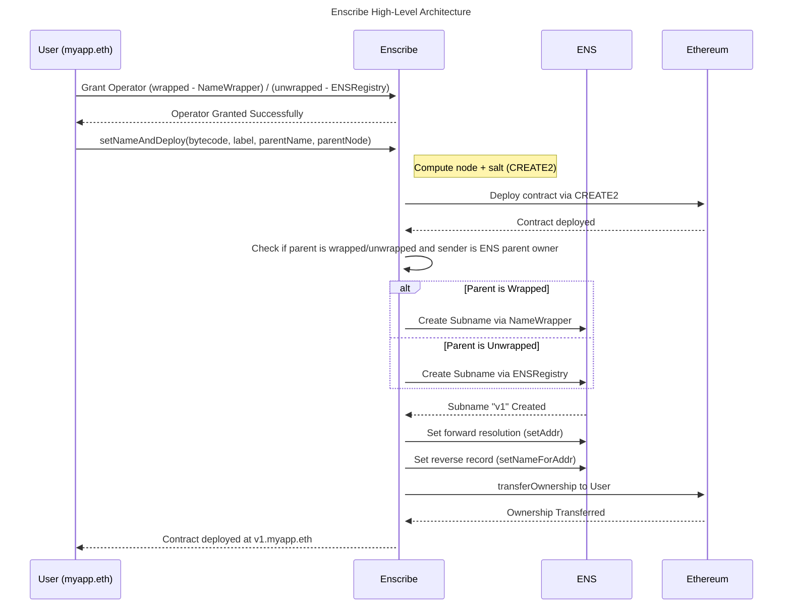

# Design And Architecture

Enscribe brings together multiple ENS-related actions into a single atomic transaction, significantly simplifying what was previously a fragmented, manual, and error-prone process.

This documentation article explains the design and architecture of the [Enscribe contract](https://github.com/enscribexyz/enscribe-contracts/blob/main/src/main/solidity/Enscribe.sol). To explore all related contracts, visit our [Github contracts repository](https://github.com/enscribexyz/enscribe-contracts).

Key ENS Contracts used:

1. [ENS NameWrapper](https://github.com/ensdomains/ens-contracts/blob/mainnet/contracts/wrapper/NameWrapper.sol): To create subname of Wrapped ENS names
2. [ENS ReverseRegistrar](https://github.com/ensdomains/ens-contracts/blob/mainnet/contracts/reverseRegistrar/ReverseRegistrar.sol): To set primary name (reverse resolution)
3. [ENS Public Resolver](https://github.com/ensdomains/ens-contracts/blob/mainnet/contracts/resolvers/PublicResolver.sol): To set forward resolution
4. [ENS Registry](https://github.com/ensdomains/ens-contracts/blob/mainnet/contracts/registry/ENSRegistry.sol): To creat subanme, and resolve names.

Openzeppelin Contracts used:

1. [Ownable](https://github.com/OpenZeppelin/openzeppelin-contracts/blob/release-v4.9/contracts/access/Ownable.sol) - For admin controls and to transfer ownership of deployed contract back to sender.
2. [ERC1155 Receiver](https://github.com/OpenZeppelin/openzeppelin-contracts/blob/release-v4.9/contracts/token/ERC1155/IERC1155Receiver.sol) - ENS wrapped subnames are ERC1155, this contract enables Enscribe contract to receive these subnames.

## Enscribe Contract Functions

### For new contract deployment 
`setNameAndDeploy(bytes memory bytecode, string calldata label, string calldata parentName, bytes32 parentNode)`

**Input**

`bytes bytecode`: Bytecode of the Contract to be deployed along with the args

`string label`: Label or subname for the contract

`string parentName`: Parent ENS name under which contract will be deployed

`bytes32 parentNode`: NameHash of Parent ENS (Can be calculated using any Web3 Library or service)

**Returns**

`address`: Deployed contract address

### For existing contracts

#### Contracts extending Ownable/ERC173

1. `Forward Resolution - setName(address contractAddress, string calldata label, string calldata parentName, bytes32 parentNode)`

**Input**

`address contractAddress`: Contract address of the existing contract

`string label`: Label or subname for the contract

`string parentName`: Parent ENS name under which contract will be deployed

`bytes32 parentNode`: NameHash of Parent ENS (Can be calculated using any Web3 Library of service)

**Returns**

`Boolean`: success for setting forward resolution

2. `Reverse Resolution - setNameForAddr(address contractAddress, address owner, address resolver, string memory ensName)`: Called on user or Dapp side

**Input**

`address contractAddress`: The contract address of the existing contract you are setting the primary name for.

`address owner`: The owner of the reverse node in the ENS Registry

`address resolver`: The resolver to use for the reverse node. Enter the default Public Resolver

`string memory name`: The primary name to set for the contract. This must be a name that already forward-resolves to the contract address, otherwise Primary Name resolution will not work.

#### All other Existing Contracts

1. `Forward Resolution - setName(address contractAddress, string calldata label, string calldata parentName, bytes32 parentNode)`

**Input**

`address contractAddress`: Contract address of the existing contract

`string label`: Label or subname for the contract

`string parentName`: Parent ENS name under which contract will be deployed

`bytes32 parentNode`: NameHash of Parent ENS (Can be calculated using any Web3 Library of service)

**Returns**

`Boolean`: success for setting Forward Resolution

## Design Considerations

- **Security:** All ENS-related operations are gated by operator permissions and ENS parent ownership checks.

- **Atomicity:** Deployment and ENS setup are performed in a single atomic transaction.

- **Permissionless:** The user remains the ultimate owner; Enscribe temporarily holds permissions only to execute the flow.

- **Fallback Safety:** If any step fails due to ownership mismatch or unsupported contract type, the transaction reverts to prevent partial deployments.

## Sequence Diagram

## Workflow

In summary, Enscribe abstracts the complexity of deploying and naming smart contracts on Ethereum by combining everything into a single, atomic transaction. The setNameAndDeploy function encapsulates the entire flow — from CREATE2-based deployment to ENS subname creation, forward resolution, and primary name assignment — all with robust on-chain checks to ensure security, correctness, and full user control.

Checkout the [Enscribe Whitepaper](https://docs.google.com/document/d/1gp9GES6jl41CMINexCffe6J0w6vwDXEZ0sbfQrJk7is/edit?usp=sharing) for more details.