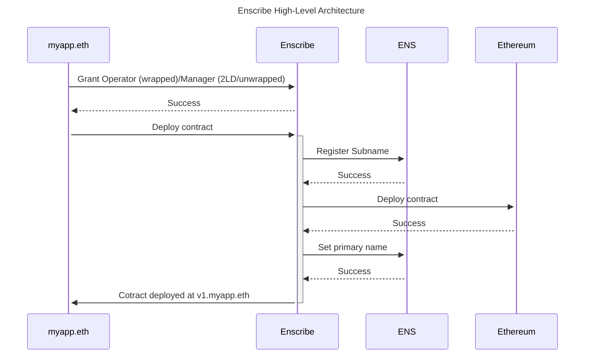

# Contract Deployment Service

## Introduction

The Enscribe Contract Deployment Service simplified contract deployment for users by assigning ENS subnames directly at contract creation. Contracts deployed through Enscribe can be resolved by human-readable ENS names, eliminating confusion associated with traditional hexadecimal addresses.

This means that if a contract is successfully deployed by the service, it will also have a primary ENS name associated with it such as in the below example.

## Getting Started

import AppUrl from '@site/src/components/AppUrl';
import ReactPlayer from 'react-player';

You can access the Contract Deployment Service at <AppUrl/>.

The below video demonstrates how to use the service.

<ReactPlayer controls url='https://www.youtube.com/watch?v=APqLhIJm5zs' />

## How It Works

The Contract Deployment Service utilises a smart contract to manage the deployment and ENS subname creation. The high-level achitecture of the service is outlined below.

Contracts deployed using this service, must implement the [Ownable interface](https://docs.openzeppelin.com/contracts/access-control#ownership-and-ownable), or [ERC-173: Contract Ownership Standard](https://eips.ethereum.org/EIPS/eip-173). This is because only the contract owner can set the reverse node for the contract address.

From the users perspective there is at most two transactions associated with using the service.

The ENS name (2LD or subname) that is owned by the user must grant privileges to the Enscribe Service to create a subname on its behalf. Depending on the type of name being used (wrapped or unwrapped subname or 2LD) the privelege the service uses differs. This is summarised in the below table:

| Name      | 2LD                                | 3LD+ or subname                  |
| --------- | ---------------------------------- | -------------------------------- |
| wrapped   | Operator granted by NameWrapper    | Operator granted by NameWrapper  |
| unwrapped | Manager granted via Base Registrar | Operator granted by ENS Registry |

Once the Enscribe Service has this privilege, it can then perform deployments on behalf of the user.

