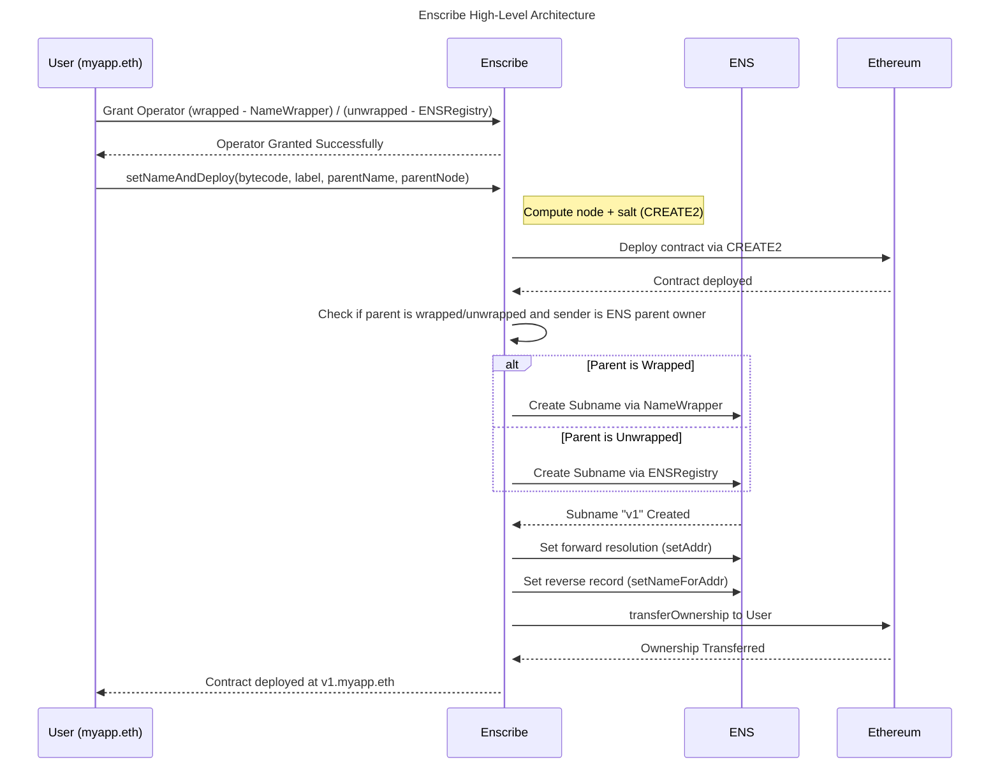

# Contract Deployment Service

## Introduction

The Enscribe Contract Deployment Service simplified contract deployment for users by assigning ENS subnames directly at contract creation. Contracts deployed through Enscribe can be resolved by human-readable ENS names, eliminating confusion associated with traditional hexadecimal addresses.

This means that if a contract is successfully deployed by the service, it will also have a primary ENS name associated with it such as in the below example.


## Getting Started

import AppUrl from '@site/src/components/AppUrl';
import ReactPlayer from 'react-player';

You can access the Contract Deployment Service at <AppUrl/>.

The below video demonstrates how to use the service.

<ReactPlayer controls url='https://www.youtube.com/watch?v=APqLhIJm5zs' />

## Deployment Form Fields


The deployment form consists of the following fields:

- Contract Bytecode
- Contract ABI (optional)
- Constructor Arguments
- Label Name
- ENS Parent Name

Each field is explained in detail below.

### Contract Bytecode

The bytecode represents your compiled smart contract in hexadecimal format.

You can obtain it by compiling your Solidity source code using tools like: Remix, solc, Hardhat, Foundry, etc

These tools typically output:
- MyContract.bin → the contract’s bytecode
- MyContract.abi → the contract’s ABI (Application Binary Interface)

Paste the contents of the .bin file into the Contract Bytecode field. This is the actual code that gets deployed on-chain.

### Contract ABI (Optional)

The ABI defines the interface of your smart contract — i.e., all callable functions, including the constructor.

While optional, providing the ABI enables Enscribe to:
- Automatically detect and decode constructor parameters
- Dynamically generate form fields to input argument values

This feature significantly reduces manual effort and potential input errors, especially for contracts with complex or nested constructor arguments.

### Constructor Arguments

Constructor arguments are the values passed to your contract’s constructor at deployment.

Key features:
- You can manually add any number and type of arguments.
- Common types (`string`, `uint256`, `address`, `bool`, etc.) are available in a dropdown.
- For more complex types (e.g., arrays, tuples, structs), select *Custom Type* and provide both the type definition and value.

Example: If the constructor accepts an array of Person structs:

```solidity
struct Person {
  string name;
  uint256 age;
  address wallet;
}
```

Then:
Custom Type: `tuple(string,uint256,address)[]`

Value:

```
[
  ["Nick", 30, "0x1bA43Becc3Ea96c37343b7CB18de7386bA29445B"],
  ["Jane", 25, "0x7cF7816d45398A1b37bBE517ca24d8CdFb8D042D"]
]
```

Ensure that all argument values are provided in the correct order and structure as expected by the constructor.

### Label Name

The Label Name represents the subdomain to be created under the specified ENS parent name.
For example:
- ENS Parent: `uniswap.eth`
- Label: `myapp`
- Resulting ENS Name: `myapp.uniswap.eth`

**Note:**
- The label must be unique under the selected ENS parent.
- The subname should not already exist

### ENS Parent Name

The ENS Parent Name is the root domain under which your subname (label) will be registered.

You can choose between:

1. Hosted ENS Parent (Managed by Enscribe)
    - No additional permissions required.
    - Enscribe manages the ENS subname and resolution.
    - Ideal for quick, low-overhead deployments.
2. Your Own ENS Parent
    - You must grant operator permissions to Enscribe’s smart contract.
    - Enscribe will use this permission to:
        - Create the subname
        - Set forward resolution to the deployed contract

**Important:** This operator role does not give Enscribe ownership or control over your ENS name. It’s similar to permissions granted to NFT marketplaces and can be revoked at any time.

### Wrapped Versus Unwrapped Names

Depending on the type of name being used (wrapped or unwrapped) the privilege the service uses differs. This is summarised in the below table:

| Name      | 2LD/subnames                       |
| --------- | ---------------------------------- |
| wrapped   | Operator granted by NameWrapper    |
| unwrapped | Operator granted by ENS Registry   |

Operator role can be given directly by User, f you haven’t already granted permission:

1. First transaction: Calls `setApprovalForAll` on the relevant ENS contract
2. Second transaction: Deploys the contract and sets ENS records in a single atomic operation

### Which type of contracts can be deployed?

As detailed in [Naming Smart Contracts](../introduction/naming-contracts#how-primary-naming-works-for-smart-contracts), ENS only allows primary name (reverse resolution) to be set if the contract implements one of the following:

- Ownable Interface (OpenZeppelin)
- ERC173
- ReverseClaimer
- ReverseSetter

#### Why These Interfaces?

These interfaces expose a method to determine or verify the contract’s owner and to claim the reverse node. ENS uses this to ensure that only the owner or contract deployers can assign the reverse node, preventing spoofing or misuse.
Enscribe supports deploying and naming contracts that implement any of the above.


#### What If My Contract Doesn’t Support These Interfaces?

If your contract doesn’t support any of the above interfaces and has already been deployed, you can still name it using Enscribe’s [**Naming Existing Contracts**](https://app.enscribe.xyz/nameContract).

Refer to [Naming Existing Contracts](naming-existing-contracts) for more details on how to.

## How It Works

The Contract Deployment Service utilises a smart contract to manage the deployment and ENS subname creation. The high-level achitecture of the service is outlined below.




