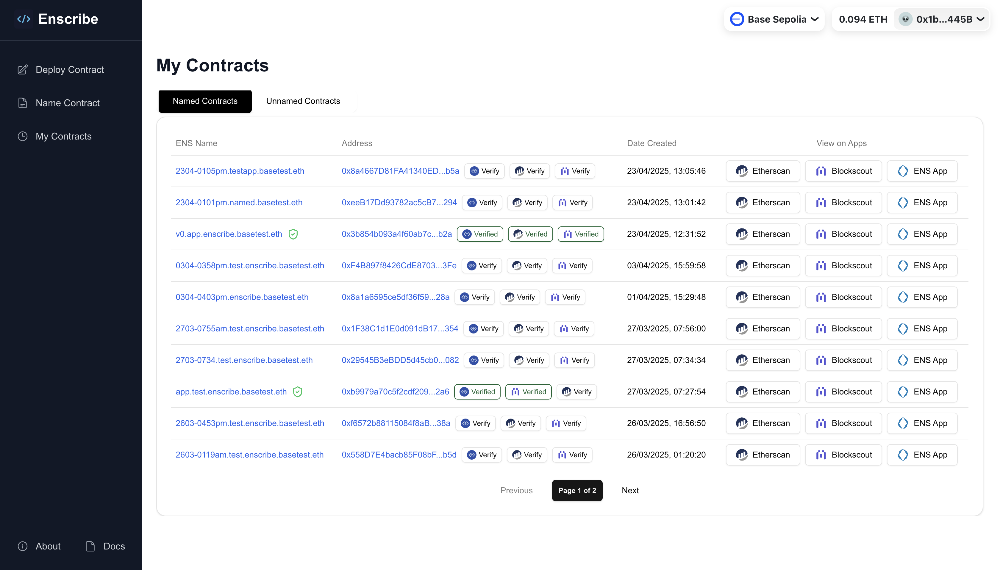
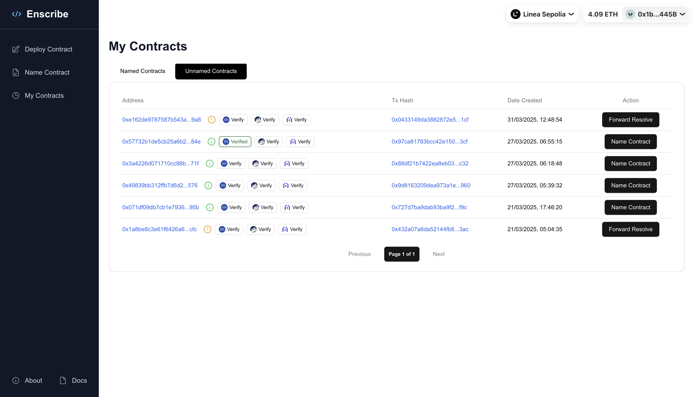

# Deployment History

import AppUrl from '@site/src/components/AppUrl';
import ReactPlayer from 'react-player';

The `My Contracts` page in the Enscribe App enables you to view and manage all smart contracts you've deployed, providing an easy way to track and name your contracts across multiple networks.

## Getting Started

You can access the `My Contracts` page from the main app located at <AppUrl/>/history/ when you are connected to your wallet.

## Named and Unnamed Contracts

The page is organized into two tabs to help you easily manage your contract deployments. Both tabs include verification status indicators:

### Named Contracts

The Named Contracts tab displays all contracts deployed by your wallet that already have a Primary ENS Name. Each contract entry shows:

- The contract's ENS name
- Contract address
- Transaction hash for creation
- Direct links to tools like Etherscan, Chainlens, and the ENS App

Each contract entry also displays verification status through visual icons and badges:

- A **green shield check icon** indicates contracts that have both a Primary ENS name and verified source code on at least one supported platform
- Direct links to view the verified source code on verification platforms

This makes it easy to verify, trust, and share your named contracts across Ethereum, Base, and Linea networks (both mainnets and testnets).

### Unnamed Contracts

The Unnamed Contracts tab shows contracts you've deployed that don't yet have an ENS Primary Name. Each entry includes:

- Contract address
- Creation transaction hash
- Contextual action button

Depending on the contract's structure, the action button will either prompt you to:
- "Name Contract" (if it supports Primary Name assignment through [Ownable](https://docs.openzeppelin.com/contracts/5.x/api/access#Ownable)/[ERC-173](https://eips.ethereum.org/EIPS/eip-173)/[ReverseClaimer](https://docs.ens.domains/web/naming-contracts/#reverseclaimersol))
- "Forward Resolve" (if only forward resolution is possible)

The interface includes helpful visual indicators:
- A yellow exclamation icon indicates contracts that support only ENS forward resolution
- A green info icon marks contracts are Ownable/ERC-173/ReverseClaimer, hence eligible for ENS primary name assignment

Clicking the action button takes you directly to the naming interface with the contract address pre-filled.

The verification status is also shown for unnamed contracts:
- If verified, you'll see a verification badge and links to view the source code
- If not verified, you'll have quick access to verification platforms

## Contract Verification

Contract verification builds credibility and trust. When paired with ENS naming, it creates a stronger trust signal for users, dApps, and wallets. Enscribe makes it easy to:

- See at a glance which contracts are verified
- View verified source code with one click through direct links
- Navigate to verification platforms if you need to verify a contract

Verification status is displayed across both Named and Unnamed contract tabs, helping you maintain transparency for all your deployments.

## How Contract Discovery Works

Enscribe's contract discovery is fully on-chain and trustless. The system:

- Automatically surfaces all contracts directly deployed by your connected wallet
- Includes contracts deployed through standard Ethereum transactions (where the transaction "to" is null)
- Includes contracts deployed using CREATE2 via Enscribe

Note: The system currently does not track indirect deployments (contracts created through another factory contract). This feature is planned for a future release.

Because data is queried from the blockchain in real-time, loading the full list of contracts happens asynchronously. You'll see a spinner at the bottom of the table while contracts are being processed.

## Video Walkthrough

The video below demonstrates how to use the My Contracts page to view your deployments and name contracts:

<ReactPlayer controls url='https://youtu.be/U4Ok3R29Vhg' />

