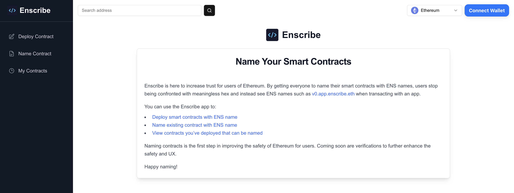

# Exploring Accounts, Contracts and ENS Names

Enscribe allows you to explore contracts and accounts across multiple networks with integrated ENS support. This guide explains how to search for and view details of any Ethereum address or ENS name across supported chains.

## Universal Search

The search bar lets you look up any Ethereum address or ENS name without connecting your wallet. Simply paste a 0x address or type an ENS name, and Enscribe will show you the relevant details.



The search works with:
- Standard Ethereum addresses (0x...)
- ENS names
- Automatic detection of which chain to use

ENS resolution works correctly across different networks, using mainnet resolvers for production chains and Sepolia for test networks, directing you to the right page based on chain context.

## Direct URL Access

You can directly access any address using this standardized URL format:

```
https://app.enscribe.xyz/explore/<chainId>/<address>
```

This URL structure makes it easy to bookmark and share addresses with others.

## Contract Details View

When viewing a contract, you'll see:

- The contract's primary ENS name (if registered) with color-coded expiry status icons:
  - Green checkmark: Valid registration (more than 3 months until expiry)
  - Yellow exclamation: Expiring soon (within 3 months)
  - Red X: Expired (in grace period)
- Verification status across multiple sources (Sourcify, Etherscan, Blockscout)
- Direct links to view verified source code
- "Verify" button option for unverified contracts
- All ENS names associated with this contract address
- ENS names owned or managed by this contract with expiration status
- Copy buttons for addresses and names with visual confirmation


This layout helps you quickly confirm contract identity and trustworthiness without navigating between multiple tools.

## Account Details View

For regular accounts (EOAs), the page shows:

- Primary ENS name (if available) with appropriate expiry status icon
- All associated ENS names pointing to this address
- ENS names owned or managed by this address with expiry information
- Copy functionality for addresses and names


Both account and contract views include external links — addresses link to Etherscan while ENS names link to the ENS app. When you click on an ENS name that a contract or account owns, Enscribe resolves it to an address and opens that address in a new tab within Enscribe.

The ENS name resolution for owned names:
- Opens resolved addresses in a new tab for convenient exploration
- Shows toast notifications for failed resolutions

## Chain Selector

The chain selector helps you navigate between networks while examining an address. It works differently based on whether your wallet is connected:

**When No Wallet is Connected:**


- Choose any supported chain from the dropdown
- Switch networks to compare the same address across chains
- All data loads specifically for the selected network

**When a Wallet is Connected:**


- Chain selector automatically syncs with your connected wallet's network
- When switching chains on wallet, you'll be redirected to view the same address on the newly selected chain

## Supported Networks

Enscribe currently supports these networks:

- **Ethereum Mainnet** 
- **Ethereum Sepolia** 
- **Linea Mainnet** (with .linea.eth domains)
- **Linea Sepolia** (with .linea-sepolia.eth domains)
- **Base Mainnet** (with .base.eth domains)
- **Base Sepolia** 

Each chain handles ENS resolution differently based on network-specific requirements. When you switch chains, the URL updates with the new chain ID, creating direct links to the same address across different networks.
