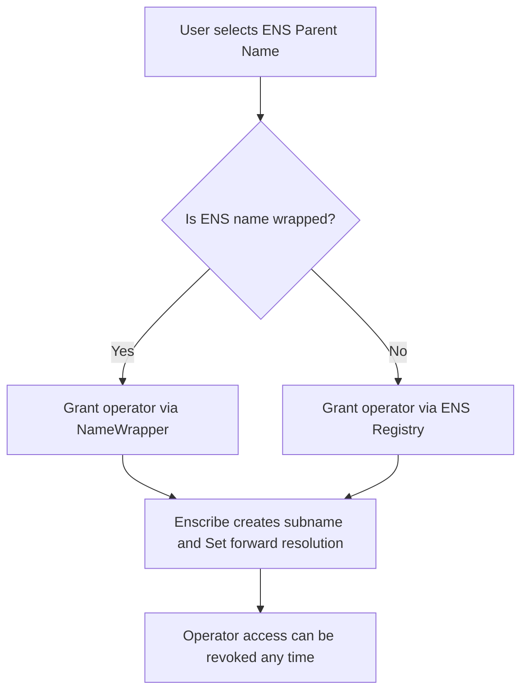
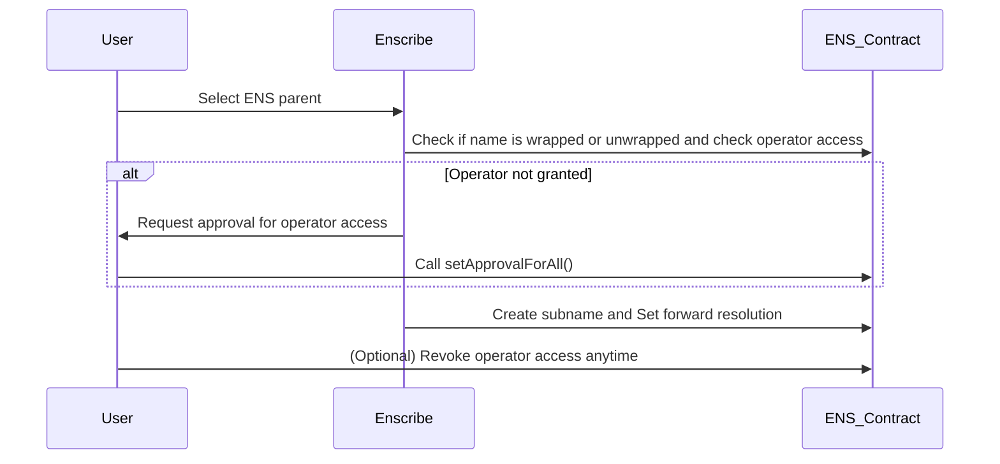

# The Operator Role in ENS, Why and How?

When using Enscribe to deploy and name contracts under your own ENS domain using a single bundled transaction, instead of multiple individual transactions, an important requirement is granting the operator role to the Enscribe smart contract. This is necessary for Enscribe to perform tasks like subname creation and ENS record management on your behalf, without needing full ownership of your domain.

## Why the Operator Role is Required

ENS names are managed on-chain, and modifying them — especially creating subnames or setting forward resolution records—requires certain permissions. If you’re using an ENS parent name owned and managed by Enscribe, no additional permission is needed. Enscribe has full control over the hosted domain and can create subnames and configure resolution without user involvement. This is ideal for simple or fast deployments.

However, when you’re using your own ENS name as the parent, for example, deploying contracts to names like `contract.myapp.eth`, Enscribe needs permission to:
- Create the subname under your parent ENS name
- Set the forward resolution (ENS name → contract address)

To do this securely and without taking ownership of your domain, Enscribe uses the standard operator role defined by ENS. Granting this role allows Enscribe to act as a delegate and manage your ENS records, similar to how you authorize marketplaces to manage your NFTs. It does not transfer ownership or managerial control of your ENS name to Enscribe, and the permission can be revoked at any time.

## How Operator Roles Work (Wrapped vs Unwrapped Names)

The ENS ecosystem currently supports two types of names: wrapped and unwrapped. The type of name determines which contract is responsible for managing operator permissions.
- **Wrapped ENS names** are managed by the NameWrapper contract. Operator roles for these names are granted via the NameWrapper.
- **Unwrapped ENS names** are managed directly by the ENS Registry. For these names, operator roles are set through the ENS Registry contract.

Subname creation and ENS record updates can only be performed by an account or contract that holds the appropriate operator role for the ENS name in use.

### How to Check If Your ENS Name Is Wrapped

Before assigning the operator role, you first need to determine whether your ENS name is wrapped or unwrapped. The easiest way is to use the ENS Manager App. Simply search for your ENS name, and under the “More” tab, you’ll see whether the name is wrapped. Alternatively, developers can directly call the isWrapped(namehash) function on the NameWrapper contract. If it returns true, the name is wrapped; otherwise, it’s unwrapped.

**Unwrapped Name Example**

**Wrapped Name Example**

## Granting the Operator Role to Enscribe

In most cases, you won’t need to worry about this.

Enscribe handles the entire permission flow automatically. During deployment or naming, the platform checks whether it already has the required operator access. If not, Enscribe will prompt you and guide you through a single transaction to grant that access, followed by the actual contract deployment or ENS setup, no need to leave the platform or interact with low-level tools. This flow ensures minimal manual steps and maximizes automation.

Only if you prefer to manage this manually, once you’ve identified the ENS name type, you’ll need to grant operator access to Enscribe through the correct ENS contract:
- If your ENS name is wrapped, call `setApprovalForAll` on the NameWrapper contract with the Enscribe contract address as the operator and true as the value.
- If your ENS name is unwrapped, call `setApprovalForAll` on the ENS Registry contract with the same inputs.

You can execute these transactions using Etherscan’s *Write Contract* feature, Remix, or any other contract interaction tool. To find the correct ENS contract addresses for the network you’re on, refer to the official [ENS deployment documentation](https://docs.ens.domains/learn/deployments/). The Enscribe contract address for your chain can be found in [Supported Networks](../introduction/supported-networks).

But for almost all users, Enscribe takes care of this for you, minimizing friction and keeping the entire process within a single intuitive flow.

## Is It Safe to Grant Operator Access?

Yes. Granting Enscribe the operator role does not mean giving up ownership of your ENS name. Enscribe cannot transfer or sell your name, nor can it change ownership or management settings. Operator access only enables specific ENS record-related operations like creating subnames and updating resolution data.

Furthermore, the Enscribe contract includes built-in checks to ensure only the actual owner of the ENS parent can initiate naming transactions. This means no one else can use Enscribe to manipulate or create subnames under your domain. Permissions are revocable at any time by calling setApprovalForAll(operator, false) on the corresponding ENS contract.
